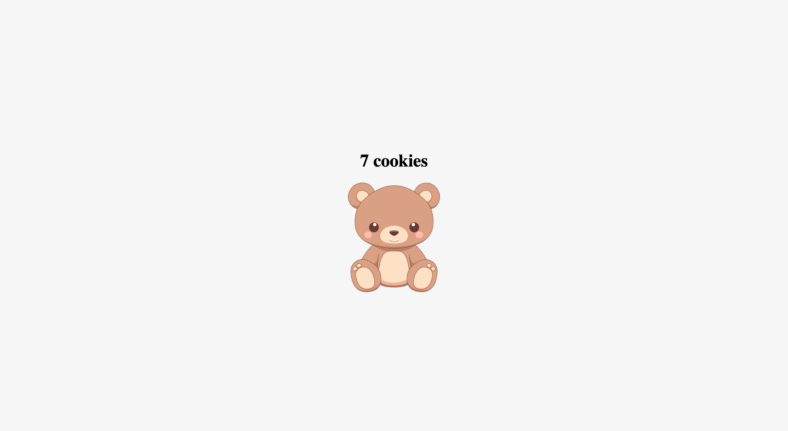

# Cookies

## Description

The Cookies project is a simple web application that allows users to click on a heading to increment a cookie count displayed on the page. It's a fun and interactive way to demonstrate basic JavaScript functionality.

## Features

- Displays a counter that increments each time the heading is clicked.
- Responsive design for optimal viewing on different devices.
- Simple and intuitive user interface.

## Visual Design

Below is a visual representation of the website page:



## Getting Started

### Prerequisites

- A web browser to view the application.
- Basic knowledge of HTML, CSS, and JavaScript.

### Installation

1. Clone this repository to your local machine using:

   ```bash
   git clone https://github.com/yourusername/cookies.git
   ```

2. **Navigate to the project directory:**

```bash
cd javascript-scrimba-learn-javascript-build-a-mobile-app-latest-news
```

3. **Open the `index.html` file in your web browser.**

```bash
open index.html
```

OR

3. **Open the project using Live Server:**

If you're using Visual Studio Code, install the Live Server extension.
Click on the "Go Live" option to run the project.

**Note:** This project requires a Firebase Database to store and retrieve data. Please set up a Firebase project and update the `databaseURL` in the JavaScript code accordingly.

## Usage

- Once the application is open, you will see the title "The Scrimba Times" and a list of news stories (if available).
- The stories list will update automatically when new entries are added to the Firebase database.
- Double-click on a story to remove it from the database and the displayed list.

## Technologies Used

- **HTML**: Structure of the web application.
- **CSS**: Styling of the application (see `index.css` for styles).
- **JavaScript**: Functionality to handle click events and update the counter (see `index.js`).

## Resources

Feel free to explore the code. Happy coding!
